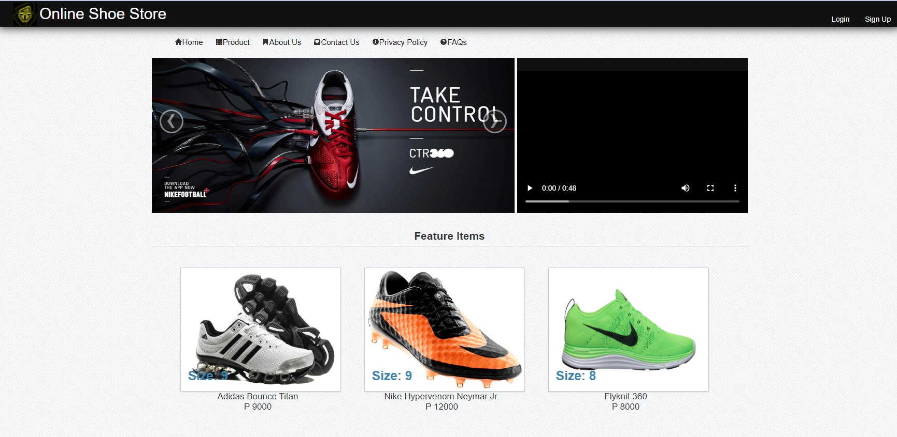
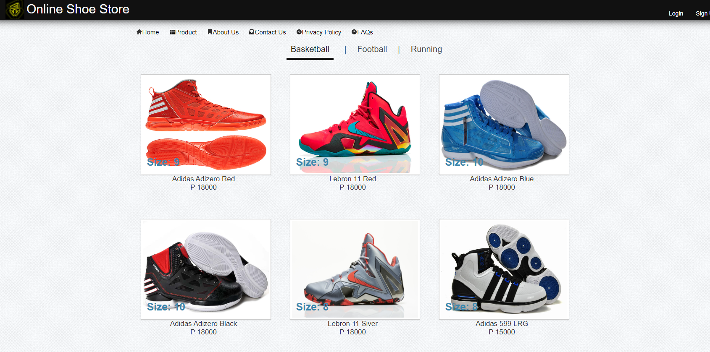
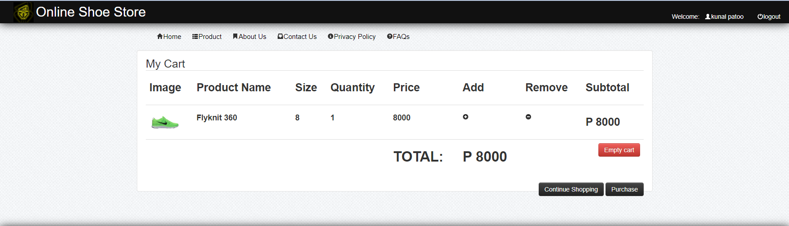

# 🥿👟👠 Online Shoes Website  
The **Online Shoes Website** is a fully functional e-commerce platform built using **PHP**. This project allows users to browse a wide collection of shoes, add items to their cart, and place orders. It provides an interactive shopping experience with a user-friendly interface, secure checkout, and dynamic product pages. This project serves as a practical resource for learning **backend development, CRUD operations, and database management**.  

## 🌟 **Key Features**  
- 🛒 **Product Catalog**: Browse a collection of shoes with images, prices, and descriptions.  
- 🔍 **Search & Filter**: Search for shoes by name, category, or price range.  
- 📦 **Shopping Cart**: Add items to the cart, update quantities, and view the total cost.  
- 💳 **Order & Checkout**: Place orders securely with an interactive checkout system.  
- 👤 **User Authentication**: Sign up, log in, and manage user profiles.  
- 📜 **Admin Panel**: Manage products, view orders, and update inventory (if applicable).  

## 🌟 **Technologies Used**  
- 💻 **Languages**: PHP, HTML, CSS, JavaScript  
- ⚙️ **Frameworks**: Bootstrap (for styling)  
- 🗄️ **Database**: MySQL (for user, product, and order data)  
- 🔐 **Security**: Data validation, user authentication, and encrypted passwords  

## 🚀 **How to Run**  

1️⃣ **Clone the repository**:  
```bash
git clone https://github.com/your-username/Online-Shoes.git
```  

2️⃣ **Navigate to the project folder**:  
```bash
cd Online-Shoes
```  

3️⃣ **Set up the database**:  
- Import the `database.sql` file into **phpMyAdmin** or MySQL.  
- Update the **database configuration** in `config.php` (or any file where database credentials are stored).  

4️⃣ **Run the server**:  
- Use **XAMPP**, **MAMP**, or **WAMP** to start the local server.  
- Place the project files in the `htdocs` directory (for XAMPP) or the relevant web server folder.  

5️⃣ **Access the website**:  
- Open a browser and go to:  
```
http://localhost/Online-Shoes/
```

## 📸 **Screenshots**  

### 🏠 Home Page  
  

### 🛍️ Product Page  
  

### 🛒 Cart Page  
  
  

## 🤝 **Contributing**  
Contributions, issues, and feature requests are welcome! Feel free to check out the [issues page](#) if you'd like to contribute.    

<h2>📬 Contact</h2>

Feel free to reach me through the below handles if you'd like to contact me.

[](https://www.linkedin.com/in/Krunal-patil-074432281)
[](https://www.instagram.com/kunal._.patil18) 


---
Made with ❤️ by krunal patil 

